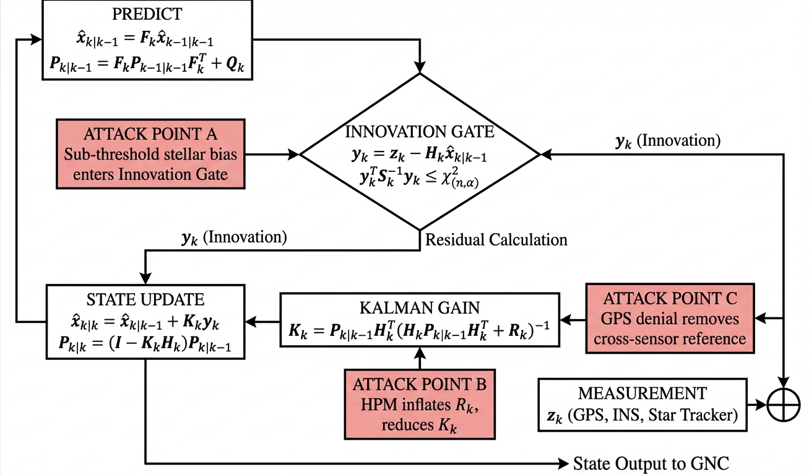
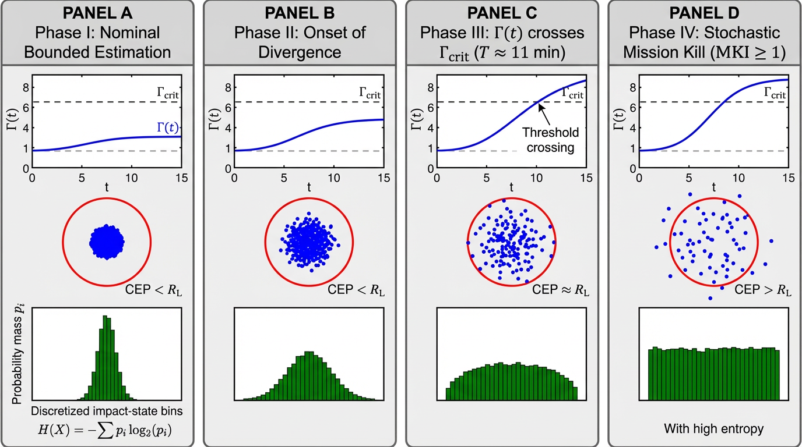
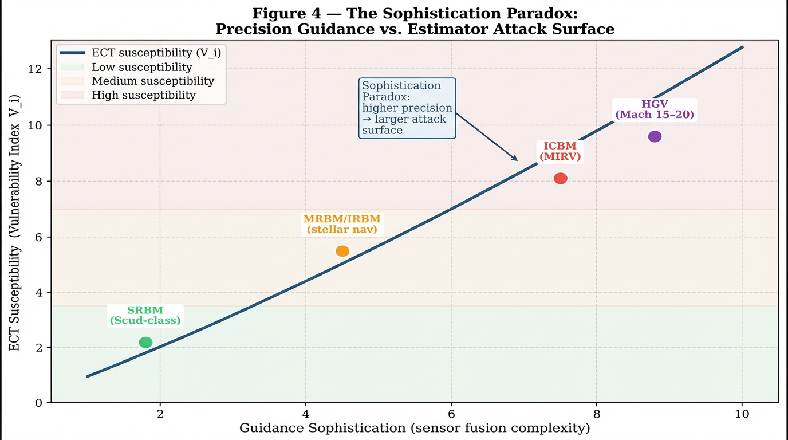
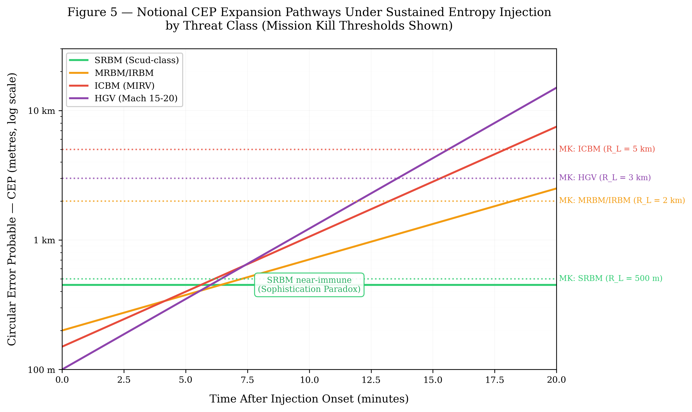
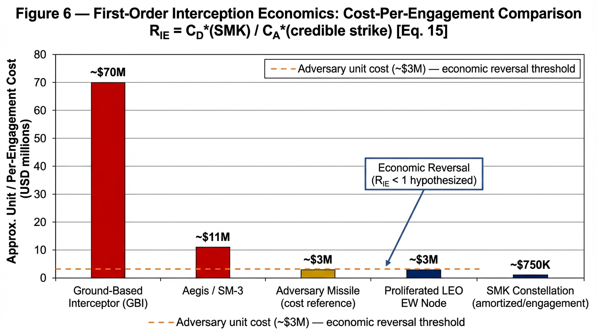

# Estimator Collapse Theory (ECT) Framework

**Version:** v1.2.0 – Submission-Ready Release (April 2026)

[](https://doi.org/10.5281/zenodo.19450239)

This repository provides the reference implementation and numerical validation scripts for the analytical framework formalised in:

> **Barua, N. (2026). Estimator Collapse Theory: Stochastic Mission Kill for Ballistic Interception.**

## 📌 Abstract
Estimator Collapse Theory (ECT) defines a new analytical regime in which ballistic mission kill emerges through state-estimator destabilisation rather than physical destruction. Unlike classical divergence analyses, this framework focuses on sub-threshold, gate-compliant perturbations that induce a **"Confidently Wrong"** failure regime. In this state, actual position error grows exponentially while the onboard filter reports deceptively stable internal covariance. This release assumes a baseline LEO architecture with 100 MW peak pulse power.

## 🏷️ Keywords
Estimator Collapse Theory; Stochastic Mission Kill; Analytical Framework; State Estimation; Sensor Fusion; Guidance, Navigation, and Control; Systems Resilience; Covariance Divergence; Circular Error Probable; Economic Reversal Ratio; Mission Kill Index.

## 🧪 Minimal Constructive Demonstration
The included `ekf_scalar_demo.py` reproduces the numerical results of **Section 2.5** of the manuscript. It demonstrates that a calibrated innovation bias can drive the **Estimator Instability Number** $\Gamma(t)$ above the critical collapse threshold $\Gamma_{crit} \approx 6.5$ within a standard 15-minute midcourse engagement window.

## 📊 Key Dimensionless Metrics
The framework introduces four primary metrics to quantify the estimator-collapse regime:

* **$\Gamma(t)$**: The **Estimator Instability Number**, defined as the ratio of actual Mean Squared Error (MSE) of the position state estimate under attack to the nominal MSE.
* **MKI**: The **Mission Kill Index**, defined as the ratio of the expanded Circular Error Probable (CEP) to the lethal radius $R_L$.
* **$\eta_{info}$**: The **Information-to-Energy Yield**, quantifying the uncertainty-generation efficiency of a perturbation mechanism using differential Shannon entropy $\Delta h(X)$.
* **$\mathcal{R}_{IE}$**: The **Economic Reversal Ratio**, comparing the amortised cost of an SMK engagement to the unit cost of the threat.

## 🖼️ Validation Figures
High-resolution 600 DPI outputs from the analytical framework:

### Figure 1: The Drift-to-Fail Paradigm Shift

*A conceptual illustration comparing kinetic interception with Stochastic Mission Kill (SMK).*

### Figure 2: EKF Attack Surface

*Detailed signal flow showing where sub-threshold bias and covariance inflation ($R_k$) are injected.*

### Figure 3: Temporal Evolution of $\Gamma(t)$

*Evolution of the instability number demonstrating the "Confidently Wrong" regime. Threshold crossing ($\Gamma_{crit} \approx 6.5$) is achieved at $T \approx 11$ minutes.*

### Figure 4: The Sophistication Paradox

*Plot of the Vulnerability Index ($V_i$) against guidance sophistication, demonstrating that higher-precision GNC systems exhibit a larger estimator attack surface.*

### Figure 5: CEP Expansion Pathways

*Comparative expansion pathways across threat classes, illustrating the **Sophistication Paradox**.*

### Figure 6: Interception Economics

*Cost-per-engagement comparison. The SMK constellation is hypothesised to achieve economic reversal ($\mathcal{R}_{IE} < 1$) with an amortised engagement cost of **~$750K ($0.75M)**.*

## 🎥 SMK Video
[▶ Watch the SMK validation video](./stochastic_mission_kill.mp4)

## 🔗 Repository and Archival Record
This GitHub repository contains the active development version of the ECT framework. The corresponding archived and citable release is available on Zenodo:
**DOI:** [10.5281/zenodo.19450239](https://doi.org/10.5281/zenodo.19450239)

## 📖 Citation
If you use this work, please cite:
> Barua, N. (2026). *Estimator Collapse Theory: Stochastic Mission Kill for Ballistic Interception*. Zenodo. https://doi.org/10.5281/zenodo.19450239

**Associated References:**
* [31] Lewis, G.N.; Postol, T.A. Video Evidence on the Effectiveness of the Patriot Missile Defense System. *Sci. Glob. Secur.* **1993**, *4*, 1–63.
* [35] Pasqualetti, F.; Dörfler, F.; Bullo, F. Control-theoretic methods for cyber-physical security. *IEEE Trans. Control Netw. Syst.* **2014**, *1*, 50–71.

## 🚀 Quick Start
```bash
# Clone the repository
git clone [https://github.com/Nick-Barua/Estimator-Collapse-Theory-ECT-Framework.git](https://github.com/Nick-Barua/Estimator-Collapse-Theory-ECT-Framework.git)

# Enter the directory
cd Estimator-Collapse-Theory-ECT-Framework

# Install dependencies
pip install -r requirements.txt

# Run the EKF scalar demonstration (Matches Section 2.5 results)
python ekf_scalar_demo.py
