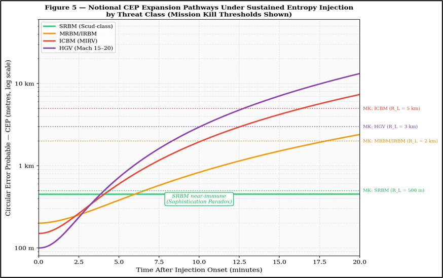

# Estimator Collapse Theory (ECT) Framework

[](https://doi.org/10.5281/zenodo.19450239)

This repository provides the reference implementation and numerical validation scripts for the analytical framework formalised in:

> **Barua, N. (2026). Estimator Collapse Theory: Stochastic Mission Kill for Ballistic Interception.**

## 📌 Abstract
[cite_start]Estimator Collapse Theory (ECT) defines a new analytical regime in which ballistic mission kill emerges through state-estimator destabilisation rather than physical destruction[cite: 7, 11]. [cite_start]Unlike classical divergence analyses, this framework focuses on sub-threshold, gate-compliant perturbations that induce a **"Confidently Wrong"** failure regime[cite: 12, 57]. [cite_start]In this state, actual position error grows exponentially while the onboard filter reports deceptively stable internal covariance[cite: 93, 96, 97].

## 🧪 Minimal Constructive Demonstration
[cite_start]The included `ekf_scalar_demo.py` reproduces the numerical results of **Section 2.5** of the manuscript[cite: 116, 117]. [cite_start]It demonstrates that a calibrated innovation bias can drive the **Estimator Instability Number** $\Gamma(t)$ above the critical collapse threshold $\Gamma_{crit} \approx 6.5$ within a standard 15-minute midcourse engagement window[cite: 12, 129, 130].

## 📊 Key Dimensionless Metrics
[cite_start]The framework introduces four primary metrics to quantify the estimator-collapse regime[cite: 37, 313]:

* [cite_start]**$\Gamma(t)$**: The **Estimator Instability Number**, defined as the ratio of actual Mean Squared Error (MSE) under perturbation to nominal MSE[cite: 85, 86].
* [cite_start]**MKI**: The **Mission Kill Index**, defined as the ratio of the expanded Circular Error Probable (CEP) to the lethal radius $R_L$[cite: 13, 102].
* [cite_start]**$\eta_{info}$**: The **Information-to-Energy Yield**, quantifying the uncertainty-generation efficiency of a perturbation mechanism[cite: 105, 106].
* **$\mathcal{R}_{IE}$**: The **Economic Reversal Ratio**, comparing the amortised cost of a Stochastic Mission Kill (SMK) engagement to the unit cost of the threat[cite: 17, 260, 261].

## 🖼️ Validation Figures
High-resolution 600 DPI outputs from the analytical framework:

### Figure 3: Temporal Evolution of $\Gamma(t)$

[cite_start]*Evolution of the instability number demonstrating the "Confidently Wrong" regime where true state error diverges while filter covariance remains deceptively bounded[cite: 98, 99, 131].*

### Figure 5: CEP Expansion Pathways

[cite_start]*Comparative expansion pathways across threat classes, illustrating the **Sophistication Paradox**—where advanced GNC systems are more susceptible to estimator attack[cite: 14, 192, 202].*

## 🚀 Quick Start
```bash
# Clone the repository
git clone [https://github.com/Nick-Barua/Estimator-Collapse-Theory-ECT-Framework.git](https://github.com/Nick-Barua/Estimator-Collapse-Theory-ECT-Framework.git)

# Enter the directory
cd Estimator-Collapse-Theory-ECT-Framework

# Install dependencies
pip install -r requirements.txt

# Run the EKF scalar demonstration
python ekf_scalar_demo.py
