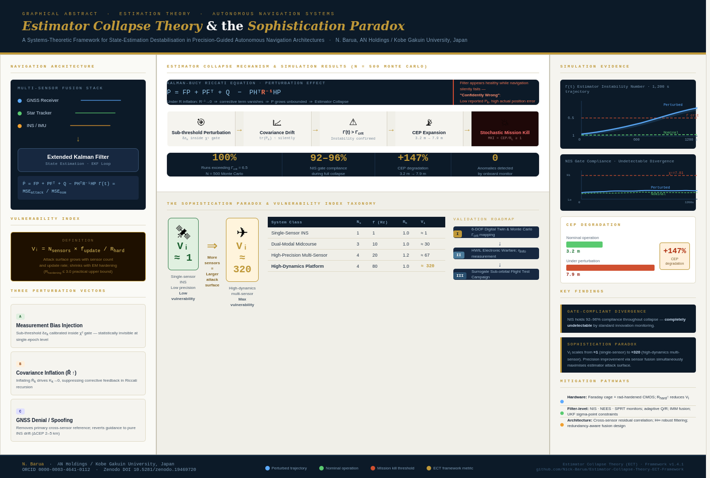
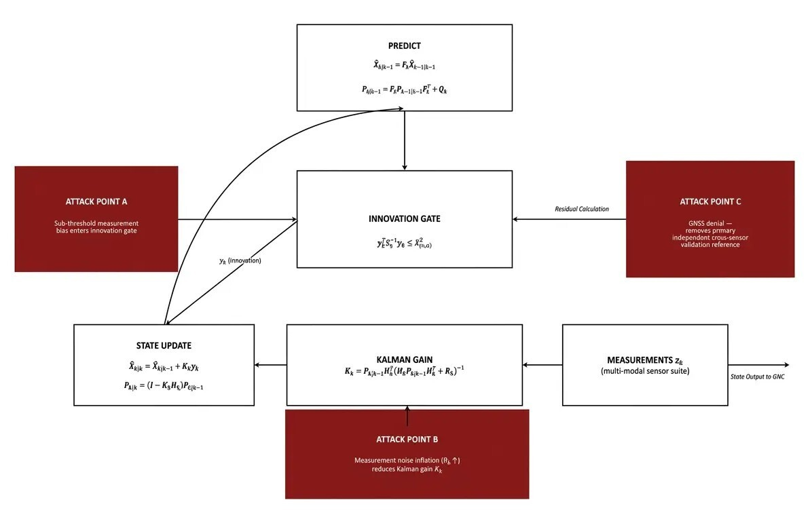
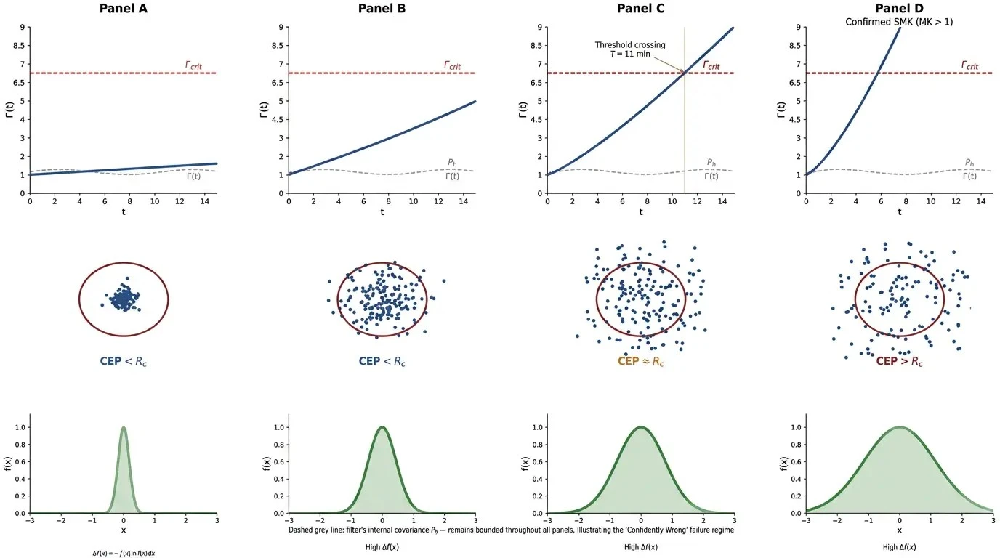
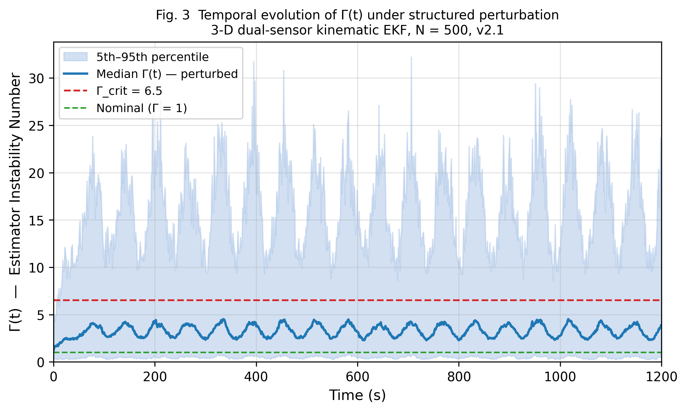
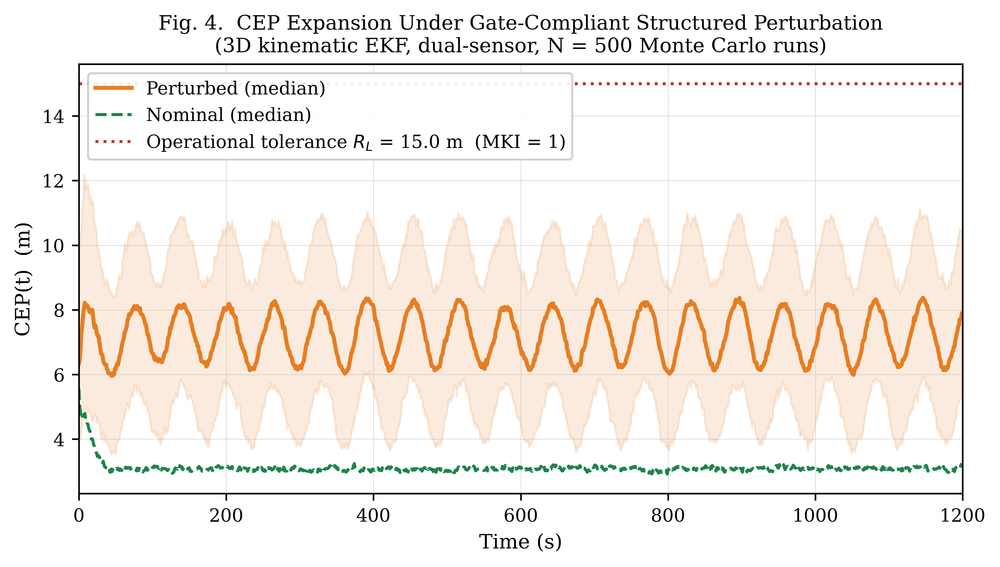
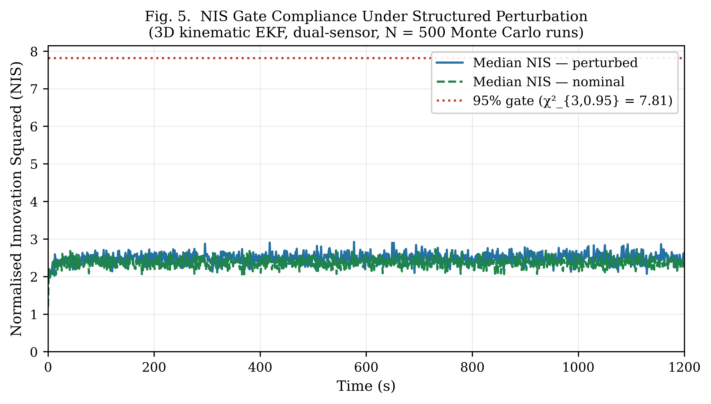

# The Sophistication Paradox: A Systems-Theoretic Framework for Estimator Collapse in Precision-Guided Autonomous Navigation Architectures

[](https://doi.org/10.5281/zenodo.20131335)
[](https://github.com/Nick-Barua/Estimator-Collapse-Theory-ECT-Framework/releases/tag/v2.1-final)
[](LICENSE)

**Version:** v2.1.0 – Final Archival & Verification Release (May 2026)  
**Authors:** Nick Barua¹·² and Robert J. Douglas¹·³

¹ *AN Holdings CO., Nishinomiya, Japan* | ² *Kobe Gakuin University, Kobe, Japan* | ³ *Kobe Design Lab, Kobe, Japan*

---

<div align="center">
  
  <br><em>Graphical Abstract — Estimator Collapse Theory &amp; The Sophistication Paradox</em>
</div>

---

## Overview

This repository provides the reference implementation and Monte Carlo validation suite for **Estimator Collapse Theory (ECT)**. ECT formalises a failure pathway in recursive state estimators where sub-threshold structured perturbations induce silent divergence whilst standard statistical health monitors report nominal behaviour.

The central finding is a **"Confidently Wrong"** result: under gate-compliant perturbations, the filter's self-reported uncertainty (CEP) remains effectively invariant whilst actual position error (TPE) diverges beyond operational requirements. This occurs because sub-threshold disturbances remain statistically indistinguishable from noise at the single-epoch level but accumulate systematically across successive filter updates.

> *Software companion to:* **"The Sophistication Paradox: A Systems-Theoretic Framework for Estimator Collapse in Precision-Guided Autonomous Navigation Architectures"** — Submitted to *CEAS Aeronautical Journal* (2026).

---

## Visual Demonstration: Operational Failure Transition

https://github.com/Nick-Barua/Estimator-Collapse-Theory-ECT-Framework/blob/main/ECT_SMK_Conceptual_Overview.mp4

| Panel | Description |
| :--- | :--- |
| **1 — Instability Number** | Contrasts actual estimation error with filter-reported covariance. |
| **2 — Telemetry** | Real-time tracking of the Mission Kill Index (MKI); failure confirmed at $\Gamma(t) > \Gamma_{crit} = 6.5$. |
| **3 — CEP** | Expansion of Circular Error Probable relative to operational tolerance $R_L$. |
| **4 — Information Theory** | Systematic growth of Shannon entropy $h(X)$, representing guidance uncertainty growth. |

---

## The Sophistication Paradox

ECT formalises the **Sophistication Paradox** via the Vulnerability Index $V_i$:

$$V_i = \frac{N_{\text{sensors}} \times f_{\text{update}}}{R_{\text{hardening}}}$$

Advanced multi-sensor fusion architectures improve nominal precision whilst simultaneously expanding the estimator's vulnerability surface. The very capability that maximises guidance accuracy — high-fidelity multi-modal sensor fusion — constitutes its primary estimator vulnerability surface.

<div align="center">
  
  <br><em>Fig. 1. Extended Kalman Filter loop and principal perturbation entry points: A — Measurement Bias; B — Covariance Inflation; C — GNSS Denial.</em>
</div>

| System Class | $N_s$ | $f$ (Hz) | $R_h$ | $V_i$ (indicative) | Representative Example |
| :--- | :---: | :---: | :---: | :---: | :--- |
| Single-Sensor INS Platform | 1 | 1 | 1.0 | $\approx 1$ | Short-range UAV |
| Dual-Modal Midcourse System | 3 | 10 | 1.0 | $\approx 30$ | MALE UAV |
| High-Precision Multi-Sensor Platform | 4 | 20 | 1.2 | $\approx 67$ | HALE / Orbital Asset |
| **High-Dynamics Multi-Sensor Platform** | **4** | **80** | **1.0** | **$\approx 320$** | **Re-entry Vehicle** |

---

## 3-D Monte Carlo Validation (v2.1)

Reproduces all empirical results reported in Section II-E of the manuscript. The simulation employs a 6-state constant-velocity kinematic EKF with dual-sensor fusion (GNSS + nonlinear range), paired-seed Monte Carlo runs, and a fixed master seed for full numerical reproducibility.

### Reproducibility Parameters (Table I — v2.1 Locked)

| Parameter | Value |
| :--- | :--- |
| Monte Carlo runs ($N$) | 500 (paired-seed) |
| Trajectory duration | 1,200 s |
| Sampling interval ($\Delta t$) | 1 s |
| Perturbation amplitude ($A$) | 2.5 m |
| Perturbation frequency ($\omega$) | 0.05 rad/sample |
| Innovation gate ($\chi^2_3$) | 7.81 (95% significance) |
| Process noise $Q$ | $\text{diag}(0.01, 0.01, 0.01, 0.001, 0.001, 0.001)$ |
| GNSS measurement noise $R$ | $\text{diag}(25, 25, 25)$ m² |
| $\Gamma_{crit}$ threshold | 6.5 |
| Master seed | 42 |
| Code version | v2.1 |

### Verified Results (v2.1 Archival Anchor)

| Metric | Result |
| :--- | :--- |
| Instability Number $\Gamma(t) > \Gamma_{crit}$ | **100%** of runs |
| NIS Gate Compliance | **94.8%** |
| Filter-reported CEP | **2.43 m** (effectively invariant; $|\Delta| < 0.01$ m) |
| True Position Error (TPE) | **2.61 m → 4.37 m (+67%)** |
| Mission Kill Index ($R_L = 15$ m) | **MKI = 0.29** |
| Mission Kill Index ($R_L = 3$ m) | **MKI = 1.46** (confirmed SMK) |

<div align="center">
  
  <br><em>Fig. 2. Temporal evolution of the Estimator Instability Number $\Gamma(t)$. Panel D confirms the SMK condition whilst internal filter covariance remains bounded — illustrating the covariance–truth divergence characteristic of Estimator Collapse.</em>
</div>

<div align="center">
  
  <br><em>Fig. 3. 100% any-time exceedance of $\Gamma_{crit} = 6.5$ across $N = 500$ paired-seed runs. Median $\Gamma(t)$ (blue) with 5th–95th percentile band (shaded). 3-D dual-sensor kinematic EKF, v2.1.</em>
</div>

<div align="center">
  
  <br><em>Fig. 4. The "Confidently Wrong" signature: filter-reported CEP (red) remains effectively invariant at 2.43 m whilst TPE (blue dashed) diverges to 4.37 m (+67%). Panel (c) confirms $|\Delta\text{CEP}| < 0.01$ m. Panel (d) shows terminal TPE distribution across all $N = 500$ runs.</em>
</div>

<div align="center">
  
  <br><em>Fig. 5. NIS gate compliance: perturbed case (94.8%) is visually indistinguishable from nominal (95.0%), confirming that the 100% $\Gamma(t)$ exceedance is entirely undetectable by conventional single-epoch innovation monitoring.</em>
</div>

---

## Dimensionless Metrics

ECT introduces four primary metrics to characterise the failure regime:

| Metric | Definition | Status |
| :--- | :--- | :--- |
| $\Gamma(t)$ | Ratio of actual MSE to nominal MSE — primary instability indicator | Validated (v2.1) |
| MKI | Ratio of realised TPE to operational failure threshold $R_L$ | Validated (v2.1) |
| $\eta_{\text{info}}$ | Efficiency of uncertainty generation per unit delivered energy (Shannon entropy) | Validated (v2.1) |
| $R_{IE}$ | Economic cost–benefit ratio; energy cost vs guidance degradation achieved | Reserved for Phase II HWIL |

---

## Repository Structure

Estimator-Collapse-Theory-ECT-Framework/
├── ECT_3D_Simulation_v141.py   # Core Monte Carlo simulation engine (v2.1 locked parameters)
├── Figures/
│   ├── Figure_1.png            # EKF loop and perturbation entry points
│   ├── Figure_2.png            # Temporal evolution of Γ(t)
│   ├── Figure_3.png            # Monte Carlo Γ(t) exceedance (N=500)
│   ├── Figure_4.png            # "Confidently Wrong" CEP vs TPE signature
│   └── Figure_5.png            # NIS gate compliance (nominal vs perturbed)
├── Graphical_Abstract.png      # Visual overview of ECT framework
├── requirements.txt            # Python dependencies
└── LICENSE                     # Apache 2.0

---

## Quick Start

```bash
git clone https://github.com/Nick-Barua/Estimator-Collapse-Theory-ECT-Framework.git
cd Estimator-Collapse-Theory-ECT-Framework
pip install -r requirements.txt
python ECT_3D_Simulation_v141.py
```

**Expected outputs:** Figs 3–5 regenerated to `/ecf_v21_output/`, verification table printed to console, all metrics matching the locked values in Table I above.

---

## Citation

If you use this code or framework, please cite the companion paper and this repository:

```bibtex
@article{barua2026sophistication,
  title   = {The Sophistication Paradox: A Systems-Theoretic Framework for Estimator 
             Collapse in Precision-Guided Autonomous Navigation Architectures},
  author  = {Barua, Nick and Douglas, Robert J.},
  journal = {CEAS Aeronautical Journal},
  year    = {2026},
  note    = {Submitted}
}

@software{barua2026ect,
  author    = {Barua, Nick and Douglas, Robert J.},
  title     = {The Sophistication Paradox: Estimator Collapse Theory (ECT) Framework v2.1.0},
  year      = {2026},
  publisher = {Zenodo},
  doi       = {10.5281/zenodo.20131335},
  url       = {https://doi.org/10.5281/zenodo.20131335}
}
```

## Licence

This project is licensed under the [Apache 2.0 Licence](LICENSE).

© 2026 Nick Barua and Robert J. Douglas, AN Holdings CO., Nishinomiya, Japan.

