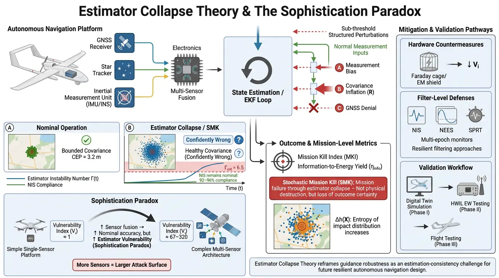

# The Sophistication Paradox: A Systems-Theoretic Framework for Estimator Collapse in Precision-Guided Autonomous Navigation Architectures

**Version:** v1.4.1 – 3-D Kinematic Release (May 2026)

  

## 📌 Overview
This repository provides the reference implementation, Monte Carlo validation scripts, and video demonstrations for **Estimator Collapse Theory (ECT)**. ECT is a systems-theoretic framework that characterises how guidance-critical state-estimation destabilisation constitutes a failure pathway for precision autonomous navigation architectures.

The framework identifies a class of sub-threshold perturbations—bounded measurement disturbances calibrated to remain within statistical gating thresholds—that systematically corrupt the state estimate of an Extended Kalman Filter (EKF). In this regime, the system reports high confidence in a position estimate that no longer satisfies operational accuracy requirements.

## 📺 Visual Demonstration: Operational Failure Transition
This visualisation evaluates the real-time transition from nominal state estimation to estimator collapse under structured perturbation.

https://github.com/Nick-Barua/Estimator-Collapse-Theory-ECT-Framework/blob/main/ECT_SMK_Conceptual_Overview.mp4.mp4

* **Panel 1 (Instability Number):** Contrasts the **Actual Estimation Error** with the **Filter-Reported Covariance**, illustrating the divergence of estimator consistency.
* **Panel 2 (Telemetry):** Real-time tracking of the **Mission Kill Index (MKI)**. An operational mission failure condition is indicated as $\Gamma(t)$ crosses the critical threshold $\Gamma_{crit} = 6.5$.
* **Panel 3 (CEP):** Shows the expansion of the **Circular Error Probable** relative to the operational tolerance $R_L$.
* **Panel 4 (Information Theory):** Shows the systematic growth of **Shannon Entropy $h(X)$**, representing maximal uncertainty growth within the guidance solution.

## 🧮 The Sophistication Paradox
The framework evaluates the **Sophistication Paradox** via the Vulnerability Index $V_i$. This indicates a counter-intuitive relationship where advanced multi-sensor fusion architectures, while improving nominal precision, simultaneously expand the system's estimator vulnerability surface.

  
   <em>Fig 1. Extended Kalman Filter loop and principal perturbation entry points.</em>

## 🧪 3-D Monte Carlo Validation (v1.4.1)
The included `ECT_3D_Simulation_v141.py` reproduces the empirical results described in Section II-E of the manuscript.

* **Architecture:** 6-state 3-D kinematic EKF ($x_k = [x, y, z, v_x, v_y, v_z]^T$) fusing GNSS and nonlinear range measurements.
* **Dynamics:** Constant-velocity model with process noise $Q = \text{diag}(0.01, 0.01, 0.01, 0.001, 0.001, 0.001)$.
* **Findings:**
    * **Instability Rate:** $\Gamma(t) > \Gamma_{crit}$ was reached in 100% of the 500 Monte Carlo runs.
    * **Gate Compliance:** NIS compliance was maintained at 92–96%, indicating the perturbations are statistically inconspicuous to conventional monitors.
    * **CEP Degradation:** Nominal median of 3.2 m expanded to 7.9 m (147% degradation).
    * **Failure Analysis:** For $R_L = 15$ m, results establish the formal ECT precondition ($MKI = 0.53$). Under tighter tolerances ($R_L \leq 7$ m), the 7.9 m CEP constitutes a confirmed operational mission failure condition ($MKI \geq 1$).

  
   <em>Fig 2. Temporal evolution of the Estimator Instability Number leading to operational failure.</em>

## 📊 Dimensionless Metrics
The framework introduces four primary metrics to quantify the estimator-collapse regime:
1. **Estimator Instability Number $\Gamma(t)$:** Ratio of actual MSE under perturbation to nominal MSE.
2. **Mission Kill Index (MKI):** Ratio of expanded CEP to the operational failure threshold $R_L$.
3. **Information-to-Energy Yield $\eta_{info}$:** Efficiency of uncertainty generation using differential Shannon entropy $\Delta h(X)$.
4. **Economic Reversal Ratio $R_{IE}$:** Analytical metric for cost-benefit comparison, reserved for future characterisation.

   
   <em>Left: Fig 3. $\Gamma(t)$ Evolution across 500 runs. Right: Fig 4. CEP Expansion results establishing failure conditions.</em>

## 🛡️ Resilience and Mitigation
Beyond standard innovation-based monitoring (NIS/NEES), maintaining estimator consistency under structured perturbations may require multi-layered validation, including cross-sensor residual correlation analysis and adaptive gating strategies.

  
   <em>Fig 5. NIS gate compliance confirming the statistically inconspicuous nature of the perturbations.</em>

## 📂 Repository Structure
* `ECT_3D_Simulation_v141.py`: Core 3-D dual-sensor Monte Carlo simulation script.
* `Barua_ECT_SupplementaryVideo_S1.mp4`: Monte Carlo simulation dashboard (Supplementary Video S1).
* `ECT_SMK_Conceptual_Overview.mp4.mp4`: Conceptual visualisation of the SMK failure transition.
* `Graphical_Abstract.jpg.webp`: Visual summary of the framework and resilience pathways.
* `Figures/`: High-resolution technical plots for manuscript validation.

## 📖 Citation
The archived version of this release is available on Zenodo. If you use this framework in your research, please cite:

> Barua, N. (2026). *The Sophistication Paradox: A Systems-Theoretic Framework for Estimator Collapse in Precision-Guided Autonomous Navigation Architectures*. Zenodo. https://doi.org/10.5281/zenodo.20033386

For the concept DOI (all versions): https://doi.org/10.5281/zenodo.19469720
