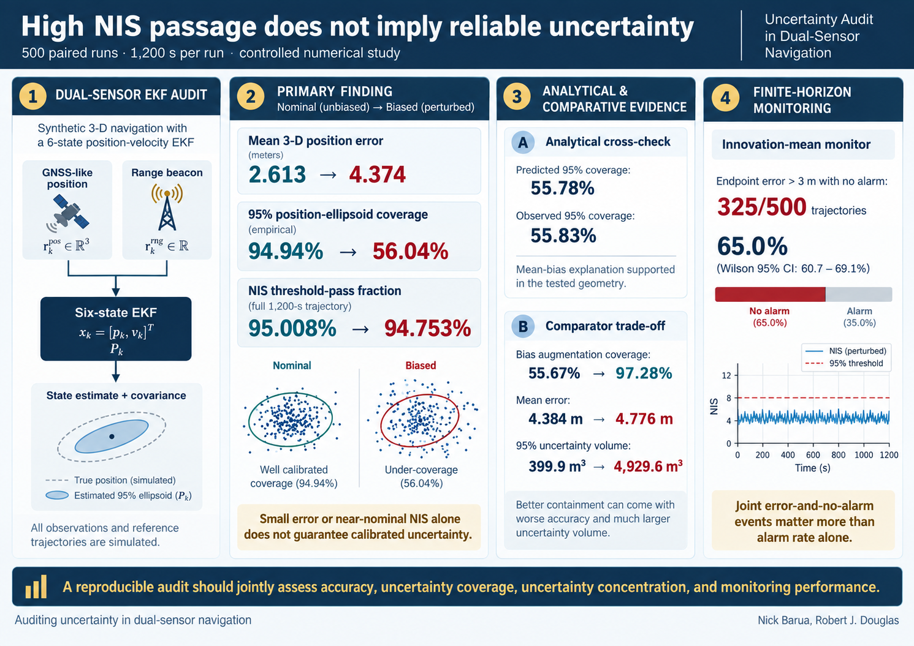

# Auditing uncertainty in dual-sensor navigation

## Accuracy, coverage and finite-horizon monitoring

**Nick Barua<sup>1,2</sup> · Robert J. Douglas<sup>3</sup>**

<sup>1</sup> AN Holdings CO., Nishinomiya, Japan  
<sup>2</sup> Department of Legal Medicine, Shiga University of Medical Science, Setatsukinowacho, Otsu, Shiga 520-2192, Japan  
<sup>3</sup> Kobe Design Lab, Kobe, Japan

**Correspondence:** [s.nick.barua@gmail.com](mailto:s.nick.barua@gmail.com)
## Graphical abstract

> **Draft illustration — not for journal submission.** This AI-generated preview is included for discussion, not as a data-derived scientific figure. In its monitoring panel, **65.0% means endpoint error greater than 3 m AND no alarm**, not the overall no-alarm rate; the remaining **35.0% must not be labelled “Alarm”**. The miniature NIS curve and ellipse sketches are illustrative, not plots of the released numerical data. Use the results and figures in the supplementary package for quantitative interpretation.

[](Graphical_Abstract.png)

*Click the image to view it at full size. All navigation observations and reference trajectories in this study are simulated.*

---

**Documentation updated:** 23 September 2026  
**Current materials:** manuscript package **v7**; numerical release **v6.0.0**  
**Publication status:** Research manuscript prepared for journal submission. No acceptance, in-press status or journal article DOI is claimed here.

> **Start here:** [Download the current supplementary methods, code, results and figures](Supplementary_Data_and_Code_v7.zip).
>
> **Legacy-material notice:** The existing top-level `Figures/` directory, `Graphical_Abstract.png`, `Barua_ECT_SupplementaryVideo_v21.mp4` and `ECT_3D_Simulation_v2_1.py` belong to earlier versions. Their numerical annotations and interpretation are superseded where they conflict with the current audit. They are retained for historical traceability, not presented as the current manuscript's evidence. Use the versioned ZIP above for the current analysis.

The repository retains its historical name, `Estimator-Collapse-Theory-ECT-Framework`, to preserve existing links. The current study is an uncertainty-evaluation protocol; the earlier claims of a universal sophistication-related vulnerability law, complete statistical undetectability and confirmed physical mission failure are not conclusions of this revision.

---

## Overview

The study evaluates a synthetic dual-sensor navigation estimator by separating four questions: how accurate its position estimate is, whether its reported uncertainty has the stated coverage, how concentrated that uncertainty is, and what an explicitly defined monitor detects over a fixed interval.

The primary model is a six-state position–velocity extended Kalman filter (EKF). It combines a three-dimensional GNSS-like position observation with a scalar range observation from a fixed beacon. “GNSS-like” denotes a noisy position solution; satellite geometry, receiver processing and radio-frequency signals are not modelled. A controlled additive measurement bias tests the consequences of an omitted systematic error.

**All navigation observations and reference trajectories are simulated.** The package does not contain recorded-sensor, hardware or flight-test validation, and the results are not deployment guarantees.

## Current supplementary package

**[Supplementary_Data_and_Code.zip](Supplementary_Data_and_Code.zip)** contains the public, identified supplementary files from manuscript package v7. The ZIP payload is unchanged from that package; only its external filename is versioned for this repository. It does not include the cover letter, internal journal-selection records or anonymous alternatives.

After extracting into a separate directory, the contents include:

```text
audit_v7/
├── README_SUPPLEMENT.txt
├── Supplementary_Methods_S1.docx
├── Supplementary_Methods_S2.docx
├── Reproducibility/
│   ├── README.md
│   ├── consistency_audit.py
│   ├── extended_audit.py
│   ├── make_figures.py
│   ├── make_extended_figures.py
│   ├── verify_release.py
│   ├── source_manifest.json
│   ├── requirements.txt
│   ├── requirements-tested.txt
│   ├── references.json
│   ├── results/
│   └── extended_results/
├── Figures/                   # Nine current main figures
└── Supplementary_Figures/     # Three current supplementary figures
```

Read **S1** for the original paired simulation and monitoring protocol, and **S2** for the additional estimator comparisons, distributional diagnostics, analytical cross-check and joint-event analysis. The internal `Figures/` folder is separate from this repository's legacy top-level folder. Current plots are provided in PNG, TIFF, PDF and SVG formats; they do not need to be uploaded individually to the repository.

## Primary numerical result

The primary experiment comprises **500 paired runs**, each containing **1,200 post-update samples** at one-second intervals. Each nominal/biased pair shares its underlying random inputs.

| Quantity | Nominal | Biased |
|---|---:|---:|
| Mean three-dimensional position error | 2.613 m | 4.374 m |
| Mean squared three-dimensional position error | 8.046 m² | 21.443 m² |
| Mean position normalised estimation error squared (NEES) | 3.010 | 8.023 |
| Empirical coverage of the stated 95% position ellipsoid | 94.94% | 56.04% |
| Covariance-derived horizontal circular-error proxy | 1.920 m | 1.920 m |
| Full-trajectory normalised innovation squared (NIS) threshold-pass fraction | 95.008% | 94.753% |

The error, NEES, coverage and circular-error rows use **samples 601–1,200**. The NIS row uses **all 1,200 samples** and the documented rounded threshold 7.81. The circular-error proxy is a horizontal approximation, not three-dimensional mean error. The exact values and uncertainty intervals are in `Reproducibility/results/baseline_summary.json`.

The primary result is **substantial uncertainty undercoverage despite a nearly nominal NIS pass fraction**. The pooled MSE ratio is **2.665** (paired-bootstrap 95% interval: **2.635–2.695**). The baseline calculates NIS but does not reject observations or implement an alarm policy; explicit hard rejection and monitoring are evaluated separately.

## Additional evidence

The original campaign includes independent-seed replication, six diagnostic comparisons, 1,000 nominal monitoring-calibration trajectories and 500 independently seeded nominal/biased monitoring-test pairs. The calibration and test blocks are separate. The original campaign contains 4,500 pairs plus 1,000 nominal-only trajectories, with shared inputs across applicable comparisons explicitly documented.

The extension compares **four fixed estimator implementations** across **12 prescribed settings**: the baseline EKF, hard innovation rejection, one-pass innovation reweighting and a bias-augmented EKF. The settings vary bias magnitude and waveform, frequency, beacon geometry, temporal noise correlation and tail behaviour. There are **2,400 independent input realisations** and **19,200 filter-condition evaluations** because four estimators and two observation conditions share each input realisation. These counts are not interchangeable. Replays of the original primary and monitoring blocks for additional diagnostics are not counted as fresh independent evidence.

The audit also evaluates coverage at **50%, 80%, 90%, 95% and 99%**, whitened-error second moments, Gaussian logarithmic scores and uncertainty-region volumes. A noncentral chi-squared approximation estimated from 250 paired runs predicts **55.78%** mean coverage at the 95% level; the other 250 runs give **55.83%**. This is a cross-check under stated distributional assumptions, not a general theorem for nonlinear navigation.

In the separate reference stress case, bias augmentation raises 95% coverage from **55.67% to 97.28%**, but mean position error increases from **4.384 to 4.776 m** and mean uncertainty-region volume grows from **399.9 to 4,929.6 m³**. Thus, improved containment need not mean improved accuracy or a more informative uncertainty statement. All specified cases, including rare severe hard-gate excursions, are retained.

Temporal monitors are evaluated at five nominal calibration targets. At the 5% target, the innovation-mean monitor leaves an endpoint position error greater than 3 m with **no alarm during the declared 600-sample interval** in **325/500 biased test trajectories: 65.0%** (Wilson 95% interval: **60.7–69.1%**). This is a same-trajectory joint-event frequency for an illustrative radius, not a certified integrity-risk bound or physical failure probability. Parameters, seed blocks, thresholds, analysis decisions and intervals are documented in S1/S2 and the machine-readable results.

## Corrections to the earlier README

| Earlier statement | Current interpretation |
|---|---|
| The reported horizontal circular-error proxy is 2.43 m. | The supplied numerical implementation yields approximately **1.920 m** in the declared analysis window. |
| Every run crossing an individual error ratio proves “100% estimator collapse”. | Individual instantaneous ratios and the ensemble MSE ratio are different. The primary ensemble ratio has a maximum of **3.573** and never exceeds the illustrative value 6.5. Any-time individual crossings are not proof of instability. |
| A nearly unchanged NIS pass fraction proves complete undetectability or “zero anomalies”. | The baseline pass fraction is not an alarm policy. Independently calibrated temporal monitoring detects a subset of biased trajectories. |
| A mean-error/tolerance ratio confirms physical mission failure. | Estimation error is not a controlled vehicle's physical path error. Task failure requires a justified physical model and event definition. |
| Adding sensing modalities universally increases vulnerability. | Performance depends on bias, information, geometry and estimator assumptions. More informative unbiased ranging improves performance in the tested comparison. |
| The manuscript is “in press” in a Springer journal. | No accepted or in-press publication is claimed for the current manuscript. |

These corrections are why the old graphical abstract, video and figure captions are no longer embedded as current results. No new standalone illustration or video is required to use the revised supplementary package.

## Verify and reproduce

Keep the archive's folder structure intact. **Extract into a new directory, not over the legacy repository files.** From the directory containing the downloaded ZIP:

```bash
python -m zipfile -e Supplementary_Data_and_Code_v7.zip audit_v7
cd audit_v7/Reproducibility
python verify_release.py
```

Verification checks **108 manifest entries** for their released byte sizes and SHA-256 hashes. It requires only Python's standard library. A successful hash check establishes file integrity, not scientific validity or a rerun of the experiments.

For numerical work, use a separate Python environment and install the supplied dependencies:

```bash
python -m pip install -r requirements-tested.txt
python consistency_audit.py --self-test --out primary_self_tests
python extended_audit.py --self-test --out extended_self_tests
```

The recorded execution environment is Python **3.13.5**, NumPy **2.3.5**, SciPy **1.17.0**, Matplotlib **3.10.8** and pandas **2.2.3**. Compatibility with other versions is not guaranteed. Follow the extracted `Reproducibility/README.md` for full-campaign and figure-regeneration commands. Full runs can overwrite their output directories; work on a copy to preserve the released files.

The repository-root v2.1 script and its `requirements.txt` are **legacy**, not the current reproduction entry point. The current package is self-contained for the main analysis; the legacy script is needed only for an optional historical comparison.

**Archive SHA-256:**

```text
0f3bb61c3cad954e4c3ddfab4d48ac769acb942b24115aca6d9cc0150cbf0857
```

## Version history and citation

**v2.1** refers to the legacy root simulation. **v6.0.0** identifies the expanded numerical source release inside the supplementary package. **v7** identifies the associated manuscript/package revision, including its updated title and affiliation metadata. These are material-version labels, not an assertion that a new GitHub release or tag has been created.

The earlier README cited [10.5281/zenodo.20132174](https://doi.org/10.5281/zenodo.20132174) and the all-versions identifier [10.5281/zenodo.19469720](https://doi.org/10.5281/zenodo.19469720). They are retained here as historical pointers only. Neither is asserted to identify this v7 ZIP. A version-specific DOI should be added only after the revised files have actually been deposited and checked. Updating this README alone does not update a Zenodo record.

Until a published article or verified current-package DOI is available, the manuscript can be identified without inventing a journal record:

```bibtex
@misc{barua_douglas2026uncertainty_audit,
  author = {Barua, Nick and Douglas, Robert J.},
  title = {Auditing uncertainty in dual-sensor navigation: accuracy, coverage and finite-horizon monitoring},
  year = {2026},
  howpublished = {GitHub repository and accompanying supplementary materials},
  url = {https://github.com/Nick-Barua/Estimator-Collapse-Theory-ECT-Framework},
  note = {Unpublished research manuscript; manuscript package v7; numerical release v6.0.0}
}
```

For computational reuse, also record the actual repository commit used and the supplementary ZIP checksum. The software/materials citation is not evidence of journal acceptance.

## Scope, provenance and licence

The study is a controlled, synthetic uncertainty-evaluation exercise. The fixed implementations and selected test conditions do not establish optimality, universal sensor-fusion behaviour, operational safety or external validity. Ground truth needed for NEES and coverage is available inside the simulation; these are offline evaluation diagnostics, not assumed onboard measurements.

The source package records AI-assisted coding and manuscript preparation, executed numerical outputs, verification tests and analysis decisions. The authors remain responsible for the analysis and publication claims.

The existing repository licence is available in [LICENSE](LICENSE). This README update does not alter it; retain applicable notices when reusing material.
